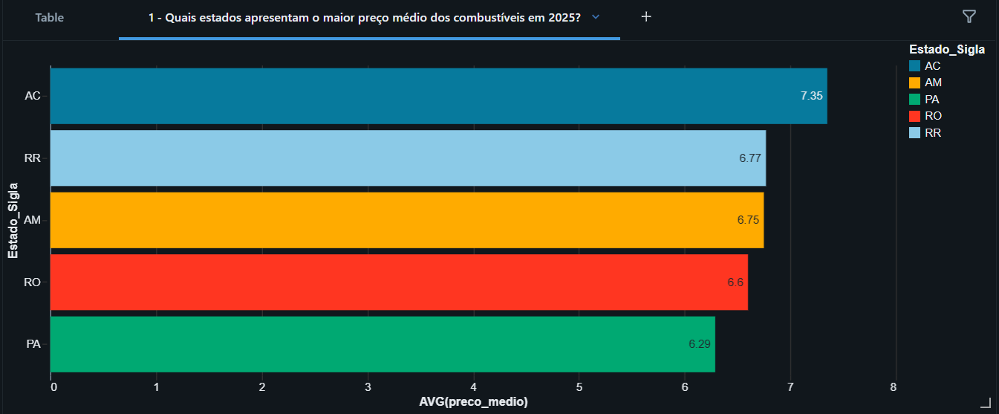
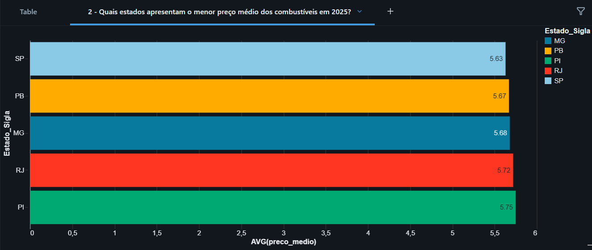
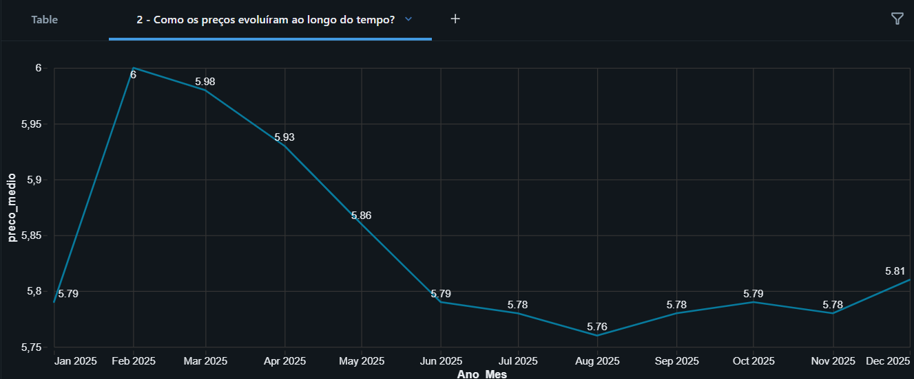
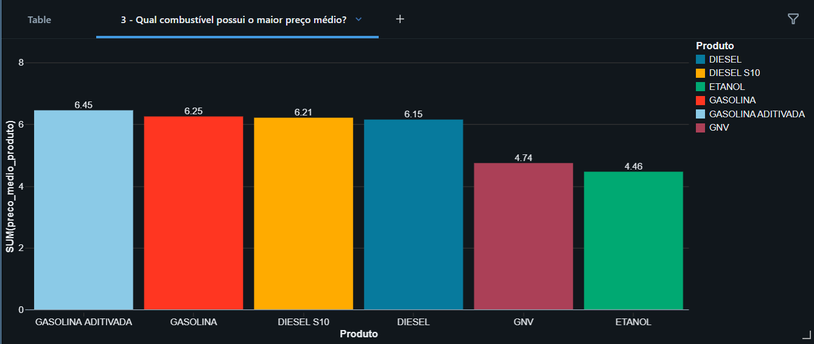
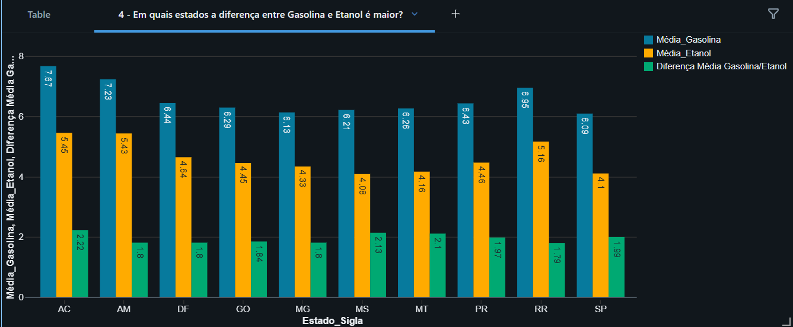
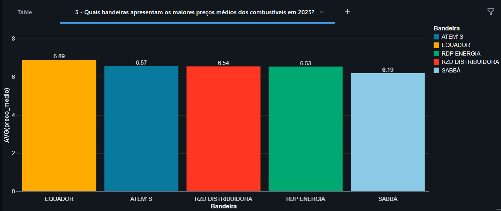

# 📊 Análises de Negócio

# ANP Analytics

Projeto de Analytics desenvolvido a partir da tabela `gold_combustivel`, produzida no projeto ETL_Preco_Combustivel_SQL.

O objetivo é responder perguntas de negócio utilizando SQL no Databricks e visualizar os resultados através de gráficos.

## Perguntas Respondidas

1. Quais estados apresentam o maior preço médio dos combustíveis em 2025?
2. Quais estados apresentam o menor preço médio dos combustíveis em 2025?
3. Como os preços evoluíram ao longo do tempo em 2025??
4. Qual combustível possui o maior preço médio?
5. Em quais estados a diferença média entre Gasolina e Etanol é maior?
6 Quais bandeiras apresentam os maiores preços médios dos combustíveis em 2025?

---

## 1. Quais estados apresentam o maior preço médio dos combustíveis em 2025?

---

## 2. Quais estados apresentam o menor preço médio dos combustíveis em 2025?

---

## 3. Como os preços evoluíram ao longo do tempo em 2025??

---

## 4. Qual combustível possui o maior preço médio?

---

## 5 - Em quais estados a diferença entre Gasolina e Etanol é maior?

---

## 6. Quais bandeiras apresentam os maiores preços médios dos combustíveis em 2025?

---

# 📌 Conclusões

As análises demonstraram diferenças significativas nos preços médios dos combustíveis entre estados, produtos e bandeiras, além de permitir acompanhar a evolução dos preços ao longo do período analisado.

Todas as consultas foram executadas sobre a camada Gold, construída previamente no projeto ETL utilizando a arquitetura Medalhão (Bronze → Silver → Gold).